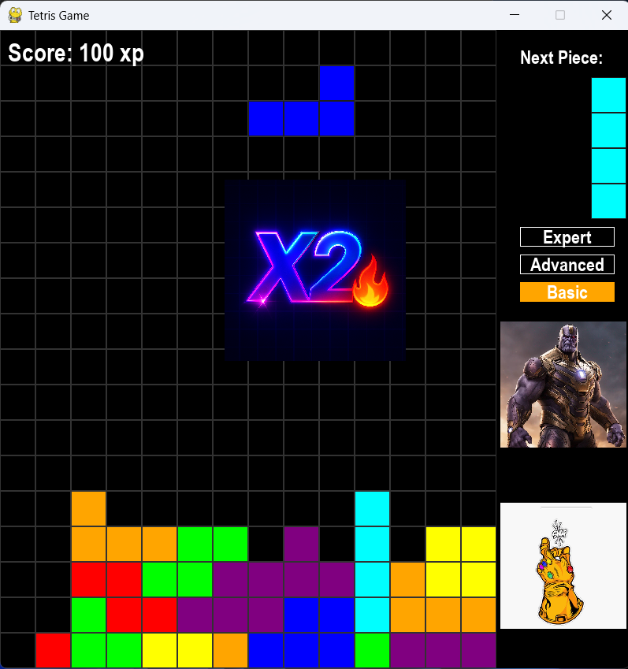

# 🎮 Yuval's Tetris Game

A modern, feature-rich Tetris game implementation built with Python, featuring multiple game modes, player profiles, score tracking, and a sleek neon-themed interface.

## 📸 Game Preview

### Main Menu

*Main menu with player selection and game options*

### Gameplay

*Active gameplay showing tetrominos, score tracking, difficulty levels, and next piece preview*

## ✨ Features

### 🎯 Core Gameplay
- Classic Tetris mechanics with smooth controls
- Multiple difficulty levels: **Basic**, **Advanced**, and **Expert**
- Score multiplier system with visual effects (X2 🔥)
- Next piece preview
- Real-time score tracking

### 👤 Player Management
- Create custom player profiles
- Choose from existing players
- Individual score history tracking
- Global high scores leaderboard

### 🎨 User Interface
- Modern neon-themed graphics
- Animated background with falling tetrominos
- Customizable grid sizes
- Responsive button layout
- Visual feedback for all interactions

### 🔊 Audio & Settings
- Background music with volume control
- Sound effects for interactions
- Mute option
- Customizable settings

### 📊 Statistics & History
- Personal score history for each player
- High scores leaderboard
- Score persistence across sessions

### 🎬 Additional Features
- About section with game information
- Intro video
- Settings panel for customization

## 🎮 Game Controls

- **←/→** Arrow Keys: Move piece left/right
- **↓** Arrow Key: Soft drop (faster descent)
- **↑** Arrow Key / **Space**: Rotate piece
- **ESC**: Pause/Menu

## 🛠️ Technical Details

### Built With
- **Python**: Core programming language
- **PySide6**: GUI framework for menus and windows
- **Pygame**: Game engine for gameplay mechanics
- **Qt**: UI styling and theming

### Project Structure
```
tetris_project_315127100/
├── Main.py                 # Application entry point
├── Game.py                 # Core game logic and mechanics
├── tetromino_data.py       # Tetromino shapes and rotations
├── Create_Player.py        # Player creation interface
├── Choose_player.py        # Player selection interface
├── Users.py                # Score history management
├── Scores.py               # High scores display
├── Settings.py             # Settings configuration
├── About.py                # About window
├── TalStuff.py             # Theme management
├── stylesheet.css          # UI styling
├── Players_Names.txt       # Player database
├── all_scores.txt          # Score records
├── settings.txt            # User preferences
└── README.md               # This file
```

## 🚀 Getting Started

### Prerequisites
```bash
Python 3.8+
PySide6
Pygame
```

### Installation

1. Clone the repository:
```bash
git clone https://github.com/Yuval-Ben-Zadik/My-Afeka-Tetris.git
cd tetris_project_315127100
```

2. Install required dependencies:
```bash
pip install PySide6 pygame
```

3. Run the game:
```bash
python Main.py
```

## 🎯 How to Play

1. **Create or Select a Player**: 
   - Click "Create Player" to make a new profile
   - Or click "Choose Player" to select an existing one

2. **Start the Game**:
   - Click "Start Game" to begin playing
   - Select your difficulty level (Basic/Advanced/Expert)

3. **Play**:
   - Use arrow keys to move and rotate pieces
   - Complete horizontal lines to score points
   - Clear multiple lines for combo bonuses
   - Try to beat your high score!

4. **View Stats**:
   - Check "Score History" for your personal records
   - View "High Scores" for the global leaderboard

## 🎨 Difficulty Levels

- **Basic** 🟡: Slower speed, perfect for beginners
- **Advanced** 🟠: Medium speed with moderate challenge
- **Expert** 🔴: Fast-paced gameplay for experienced players

## 💾 Data Persistence

The game automatically saves:
- Player profiles (`Players_Names.txt`)
- All game scores (`all_scores.txt`)
- User settings (`settings.txt`)

## 👨‍💻 Author

**Yuval Ben Zadik**
- Student ID: 315127100
- Project Type: Game
- Institution: Afeka Tel Aviv Academic College of Engineering

## 📝 License

This project was created as part of an academic assignment for the Mechatronics program.

## 🙏 Acknowledgments

- Background images created using ChatGPT
- Classic Tetris game mechanics
- PySide6 and Pygame communities for excellent documentation

---

**Enjoy the game and try to beat the high score! 🏆**
